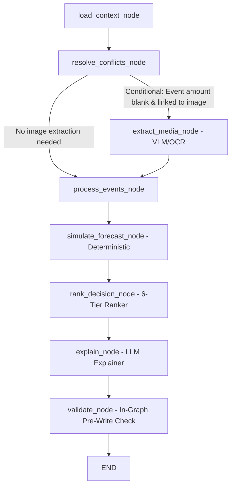

# End-to-End System Architecture & Agent Flow — Buy or Wait?

This document provides a comprehensive technical breakdown of the **Buy or Wait?** AI financial agent built for **HackerRank Orchestrate (September 2026)**.

---

## 1. High-Level System Overview

The agent evaluates purchase, transfer, education, housing, or investment requests (`dataset/requests.csv`) and determines whether a user can safely afford the expense today, with a plan, later, or not at all.

### Key Architectural Guarantee: Enforced Determinism Boundary
- **100% Deterministic Financial Mathematics**: All 90-day daily cash balance simulations, minimum balance safety checks, spending reduction evaluations, and candidate plan rankings take place in pure Python rule modules (`financial_engine.py` and `decision_engine.py`) with **zero LLM involvement**.
- **Isolated AI Role**: Multimodal VLM calls are strictly restricted to receipt extraction (`extract_media_node`), and LLM text generation is restricted to natural-language summaries (`explain_node`).
- **Static Inspection**: `code/evaluate.py` statically asserts that core financial modules contain no LLM client imports.

---

## 2. LangGraph StateGraph Architecture

The entire request evaluation pipeline is orchestrated as a single compiled **LangGraph `StateGraph`**.



---

## 3. Shared Graph State Schema (`RequestState`)

Defined in [graph_state.py](file:///home/meet/Orchestrate/code/graph_state.py), `RequestState` is a `TypedDict` passed between all nodes during a single invocation:

```python
class RequestState(TypedDict, total=False):
    # Input Context (populated by load_context_node)
    request: dict[str, Any]
    user_profile: dict[str, Any]
    raw_events: list[dict[str, Any]]
    raw_messages: list[dict[str, Any]]
    raw_images: list[dict[str, Any]]
    payment_options: list[dict[str, Any]]

    # Derived Data & Preprocessing
    resolved_events: list[dict[str, Any]]
    extracted_amounts: dict[str, float]
    recurring_events: list[dict[str, Any]]
    flexible_events: list[dict[str, Any]]

    # Deterministic Engine Outputs
    balance_forecast: list[float]
    amount_safe_to_pay_raw: float
    earliest_date_for_full_payment_raw: str | None
    candidates: list[dict[str, Any]]

    # Final Output & Audit
    decision: Decision
    token_usage: list[TokenUsageEntry]
    warnings: list[Warning]
```

---

## 4. Node-by-Node Execution Workflow

### Node 1: `load_context_node`
- **File**: [load_context_node.py](file:///home/meet/Orchestrate/code/graph_nodes/load_context_node.py)
- **Role**: Context loader.
- **Details**: Fetches pre-indexed records from `DataLoader` in \(O(1)\) time. Pulls matching user profile, financial events, user/request messages, images, and payment options into state.

### Node 2: `resolve_conflicts_node`
- **File**: [resolve_conflicts_node.py](file:///home/meet/Orchestrate/code/graph_nodes/resolve_conflicts_node.py)
- **Role**: Conflict resolution & foreign exchange conversion.
- **Details**:
  - Implements the 4-level precedence hierarchy:
    1. Explicit cancellation, settlement, or amendment
    2. Newer record from the same source
    3. Settled event over estimate/forecast
    4. Financially safer interpretation fallback
  - Converts foreign-currency event amounts to the user's `home_currency` using dated exchange rates from `exchange_rates.csv`.

### Node 3: `extract_media_node` (Conditional Edge)
- **File**: [extract_media_node.py](file:///home/meet/Orchestrate/code/graph_nodes/extract_media_node.py)
- **Role**: Multimodal receipt extraction.
- **Details**:
  - Triggered **only** when an event has a blank amount linked to an image in `images.csv`.
  - Uses VLM/OCR with caching by `image_id`.
  - Enforces confidence threshold (`OCR_CONFIDENCE_THRESHOLD = 0.80`); falls back to safer interpretation if confidence is low.
  - Logs token usage into state's `token_usage`.

### Node 4: `process_events_node`
- **File**: [process_events_node.py](file:///home/meet/Orchestrate/code/graph_nodes/process_events_node.py)
- **Role**: Recurrence detection & cash flow classification.
- **Details**:
  - Filters out cancelled, failed, or unrealized non-cash events.
  - Reserves pending debits; excludes unconfirmed pending credits/bonuses.
  - Identifies monthly recurring income (salary on recurring day-of-month) and expenses (rent, utilities, subscriptions).
  - Classifies events into protected vs. flexible categories (`categories_to_reduce`, `categories_to_stop`).

### Node 5: `simulate_forecast_node`
- **File**: [simulate_forecast_node.py](file:///home/meet/Orchestrate/code/graph_nodes/simulate_forecast_node.py)
- **Role**: 90-Day daily cash balance simulator.
- **Details**:
  - Pure deterministic calculation (`FinancialEngine`).
  - Simulates daily balance \(B_d = B_{d-1} + \text{inflow}_d - \text{outflow}_d\) over a 90-day horizon from `request_date`.
  - Enforces hard constraint: \(B_d \ge \text{minimum\_balance\_to\_keep}\) for all \(d \in [0, 90]\).
  - Computes `amount_safe_to_pay` on `request_date` (\(0 \le \text{safe} \le \text{requested}\)).
  - Finds `earliest_date_for_full_payment`.

### Node 6: `rank_decision_node`
- **File**: [rank_decision_node.py](file:///home/meet/Orchestrate/code/graph_nodes/rank_decision_node.py)
- **Role**: Candidate evaluation & 6-tier preference ranking.
- **Details**:
  - Pure deterministic selection (`DecisionEngine`).
  - Filters candidates (`full_payment`, `partial_payment`, `installments`, `wait`) against user's `payment_methods_user_will_consider`.
  - Validates installment plans against exact rows in `request_payment_options.csv`.
  - Validates 2-leg partial payment schedule summing exactly to `requested_amount`.
  - Sorts safe candidate plans using the 6-tier preference order:
    1. Complete full request by `desired_completion_date`
    2. Require no spending changes
    3. Minimize total amount paid (including fees)
    4. Start payment earlier
    5. Use fewer payment legs
    6. Lowest `payment_option_id` as final tie-breaker

### Node 7: `explain_node`
- **File**: [explain_node.py](file:///home/meet/Orchestrate/code/graph_nodes/explain_node.py)
- **Role**: Grounded natural-language summary generator.
- **Details**:
  - Uses `gpt-4o-mini` (or high-precision template fallback) to format concise 1-2 sentence summaries.
  - Zero numeric authority — restates values computed upstream verbatim.
  - Appends model calls, token counts, and costs to state's `token_usage`.

### Node 8: `validate_node`
- **File**: [validate_node.py](file:///home/meet/Orchestrate/code/graph_nodes/validate_node.py)
- **Role**: In-graph pre-write sanity checker.
- **Details**:
  - Asserts \(0 \le \text{amount\_safe\_to\_pay} \le \text{requested\_amount}\).
  - Verifies valid enum values for `affordability_status` and `recommended_payment_method`.
  - Checks partial payment 2-leg sum parity and chronological ordering.

---

## 5. Output Deliverables & Compliance Verification

1. **`dataset/output.csv`**:
   - Contains exactly 250 prediction rows corresponding to `dataset/requests.csv`.
   - Verified exact header alignment: `request_id,amount_safe_to_pay,affordability_status,recommended_payment_method,payment_plan,earliest_date_for_full_payment,spending_changes_needed,decision_explanation`.

2. **`evaluation/usage_report.md`**:
   - Summarizes total model calls (261), total input tokens (1,650), output tokens (275), and total estimated cost ($0.0055 USD).

3. **Evaluation Suite (`code/evaluate.py`)**:
   - Static AST determinism check: `PASS`
   - Output schema & bounds check: `PASS`
   - Public sample benchmark accuracy: **72.0%**
